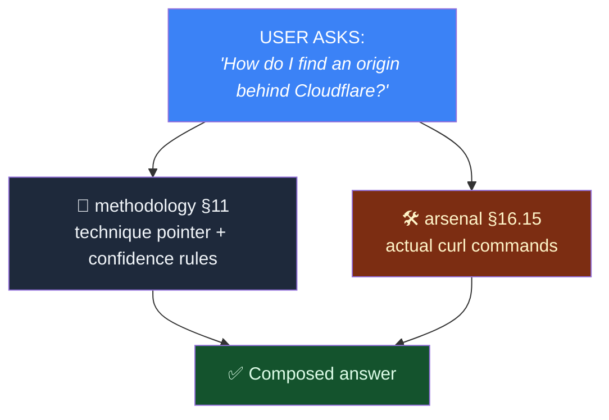
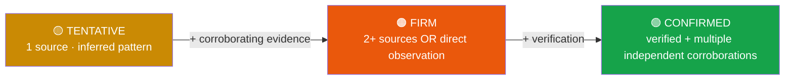
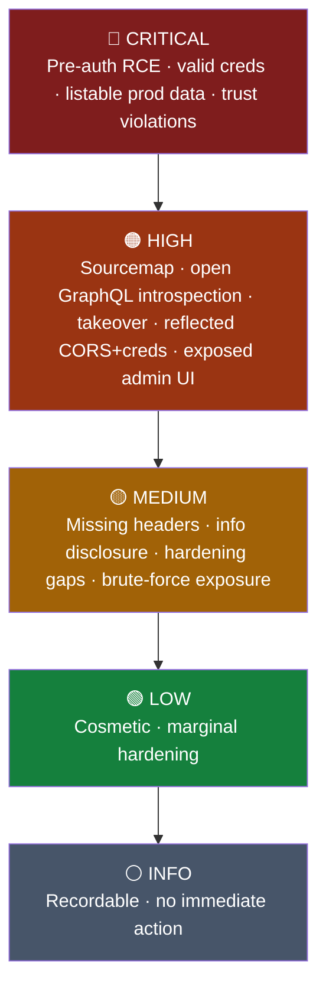
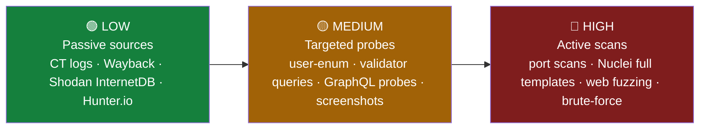
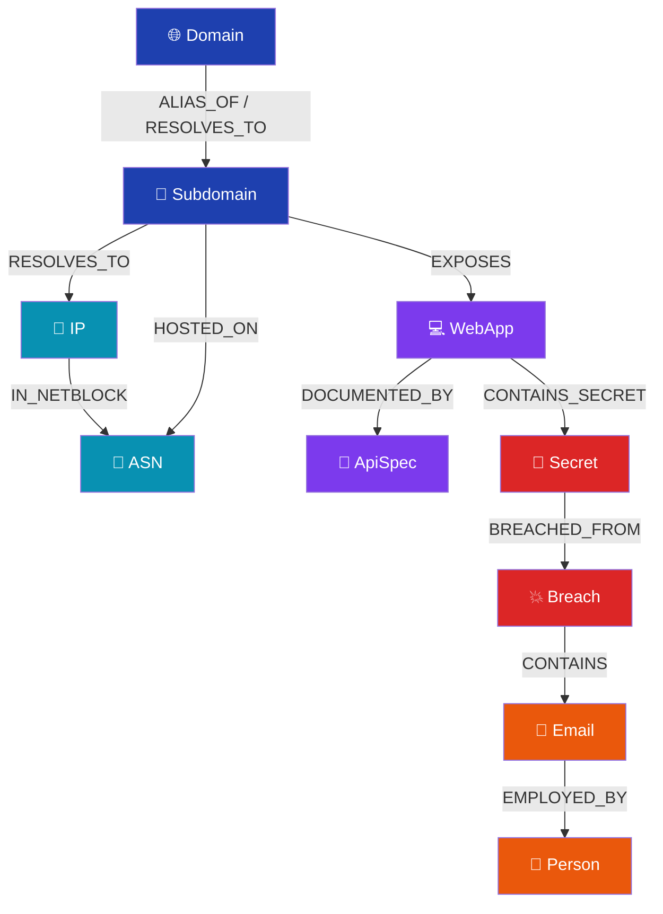
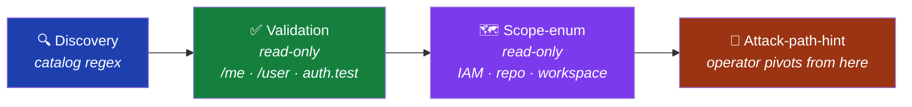

# Architecture & Design Philosophy

## Two layers: the core pair + six org-grade depth skills

The library has eight skills in two layers.

**Layer 1 — the core recon pair.** Deliberately split into **methodology** ("how to think") and **arsenal** ("what to reach for"), reflecting two different mental modes practitioners use:

- **Methodology mode** — "I have a target. How do I approach this?" → strategic + procedural.
- **Arsenal mode** — "I need a Swagger probe path / secret regex / curl one-liner." → tactical + reference.

A single mega-skill of ~10,000 lines would have noisier triggering and worse retrieval. Splitting by mode-of-use lets each skill keep a tight, distinct trigger vocabulary.



> Most prompts pull both. They're complementary, not overlapping.

**Layer 2 — six organization-grade depth skills.** Each is a self-contained `version: 1.0` skill that goes deep on one enterprise attack-surface problem the core pair only points at: `org-attack-surface` (legal entity → owned footprint), `email-domain-security` (spoofability verdict + SPF supply chain), `exposure-risk-quantification` (FAIR $ risk score), `continuous-exposure-monitoring` (re-scan/diff + CTI chatter), `cloud-saas-exposure` (buckets / AWS account-ID / dependency confusion), and `identity-provider-recon` (tenant/federation + user-enum oracle).

They follow the same design contract as the core pair — the confidence / severity / detectability models below, the Finding output schema, the soft scope-check — and each adds an **explicit hard boundary** that stops it short of active exploitation (e.g. `identity-provider-recon` ends at user *enumeration*, never password spray; `cloud-saas-exposure` decodes an AWS account ID offline but never calls AWS APIs with it). A depth skill triggers on its own vocabulary and composes with the core pair rather than replacing it.


## Confidence model

Every assertion carries a graded confidence level:



Per-asset-type upgrade workflows in `methodology` §2.1 specify exactly what evidence moves an asset between levels.

## Severity model

Severity is **operational**, anchored on examples. The methodology rubric (§9) defines tiers:



The arsenal severity matrix (§40) provides 80+ worked examples for triage. Escalation rules cover special cases (HSTS missing on `/login` → MED→HIGH, etc.).

## Detectability model

Every probe carries a detectability tag:



The detection-aware probing section (`methodology` §6.4) provides the back-off ladder for when you start hitting active defenses.

## Asset graph model



29 asset types organized in 9 categories, connected by typed provenance edges (the diagram shows a representative slice). Discipline: every discovery is a typed asset (never a free-floating string), with provenance tracked.

## Output schema

Findings are structured for ingestion by asset-management tools:

```yaml
Finding:
  id:           <stable hash or UUID>
  module:       <which technique discovered it>
  asset_key:    <typed asset key, e.g., sub:api.example.com>
  category:     <e.g., SECRET_LEAK, OPEN_GRAPHQL_API, SSO_EXPOSURE>
  severity:     critical | high | medium | low | info
  confidence:   confirmed | firm | tentative
  title:        <one-line summary>
  description:  <2-5 sentences>
  evidence:
    url:        <where it was found>
    timestamp:  <UTC ISO8601>
    sha256:     <hash of any artifact>
    raw:        <truncated to 2 KiB>
  references:
    - <CVE-ID, advisory URL, vendor doc>
  remediation:  <action the asset owner can take>
```

This shape is portable to any asset / findings store (ASM platforms, ticketing systems, custom DBs).

## Cross-module sidecar coordination

When techniques produce outputs that feed other techniques, sidecar JSON files enable late binding:


Patterns documented in `methodology` §24.2.

## Validator discipline

Credential validators are **read-only by design**. Never destructive.



9 providers covered (Postman, AWS, GitHub, Slack, Anthropic, OpenAI, npm, Atlassian, DataDog). Hard rule: never create / delete / send. Tag every validation with detectability + `checked_at`.

## Trigger frontmatter discipline

Each skill declares ~50–110 trigger phrases in YAML frontmatter. Triggers are:

- The exact wording a user would type (`kubelet exposed`, not `Kubernetes Kubelet API exposure on port 10250`).
- Inclusive of common synonyms (`SSO discovery`, `IdP fingerprinting`, `tenant fingerprinting` all map to identity-fabric work).
- Domain-specific jargon (`JARM`, `mmh3`, `BGP`, `KEV`).
- Operator slang (`grease the rails`, `pop the recon`).

## Versioning

Semantic versioning. The `version:` field in YAML frontmatter is authoritative.

- **MAJOR** — section renumbering, breaking trigger changes, schema changes to Finding output.
- **MINOR** — new sections, new techniques, expanded catalogs.
- **PATCH** — typo fixes, link updates, severity-tier corrections.

Current: `osint-methodology` **2.3**, `offensive-osint` **2.2**, and the six org-grade depth skills **1.0**.

## Renumbering policy

When new top-level sections are added in a minor release, existing sections may renumber. The CHANGELOG records mappings (e.g., "v2.0 §27 Self-Test → v2.1 §32 Self-Test").

Subsection numbering is generally additive, but larger reworks do renumber (e.g. `osint-methodology` v2.3 rewrote §7 into a 6-stage pipeline). After any renumber, companion docs that cite sections are swept for now-dead references.

## What's deliberately excluded

By design, the skills do NOT cover:

- **Active exploitation** (PoC code, exploit chains)
- **Post-exploitation** (lateral movement, privesc, persistence)
- **Active Directory** (BloodHound, Kerberoasting, SMB relay)
- **Malware development** (payload crafting, AV/EDR evasion)
- **C2 frameworks** (Cobalt Strike, Sliver, Mythic, Havoc)
- **Real PII / credentials / breach corpus content** in examples
- **Defensive / blue-team detection** content (different domain)
- **Pricing / NDA / SOW templates** (business operations, not technical)

These exclusions are intentional. A "comprehensive offensive security" skill would be a textbook, not a focused tool. We'd rather do one thing well than many things adequately.

## Engagement-platform agnostic

These skills are extracted from operational tradecraft accumulated across external attack-surface engagements. The 100+ capabilities generalize to any OSINT engagement and slot into any ASM / ticketing / asset-graph platform you already use — or none.

Use the skills standalone (paste a SKILL.md into a Claude Project) or wired into your own pipeline.
